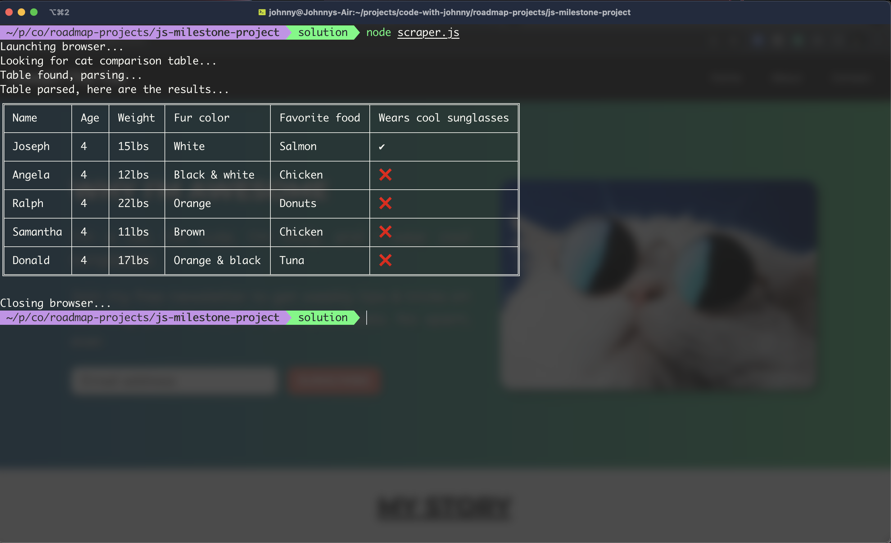

# JS Milestone Project

A JavaScript project template for the software developer roadmap.

We return to Joseph The Cat's portfolio to improve the user experience and handle form submissions. We also get crafty with node.js to do a little web scraping.

## Getting Started

To get started on this project, run the following command in your terminal.

```
git clone git@github.com:code-with-johnny/js-milestone-project.git && cd js-milestone-project
```

Run the `npm install` command to install the project's dependencies.

If you open up the project in vscode, you should see a folder called `scripts` which contains two JavaScript files, `form-handlers.js` and `smooth-scroll.js`. These files will need to be linked to the index.html (for you to figure out how to do). Take note of _when_ your JavaScript files load after you've linked them to the html. Usually, you want the script to load _after_ the html is finished rendering.

To run your web scraper, run `node scraper.js` in your terminal.

## Requirements

1. You are going to add smooth scroll animations to all the links on the page from our previous project. This means all the navbar links as well as the "back to top" button. The behaviour is the same, the links just take us to a certain part of the page. But instead of instantaneously taking us to the link target, there will be a nice smooth scroll animation.
2. All form submissions on the page should be handled with JavaScript. When a form is submitted, capture the details and use JavaScript's built-in `alert` function to alert the user that their form has been submitted successfully with said details.
3. You're going to build a web scraper in the `scraper.js` file. The scraper should utilize the `puppeteer` library to scrape your web page and fetch all the details from the cat comparison table. It should also utilize the `table` library to display the contents nicely in the terminal. The scraper should periodically log updates to the terminal to let the user know that the application is still running. It should look something like this:

## Example

GIFs are too large to be stored in this repo. You can [click here](https://www.youtube.com/watch?v=KuxQ5KrWamo&ab_channel=CodeWithJohnny) to see an example of what the project should look like.

## Solution

If you're having trouble completing this project or you want to compare your solution to the example above then you can view the solution.

You'll need to use git and switch to a branch named `solution`.

```
git fetch --all
git checkout solution
```

Once you do that, your code editor should update and you can view the `scripts` directory, the `scraper.js` file, and the udpated `index.html` file.

Please only do this if you've given it your best shot, otherwise you're only cheating yourself.

Keep in mind that there are many ways to achieve such a solution. My way is definitely not the best, and no one's way is ever really the best. A lot of a solution comes down to personal preference and style as well as finding what works.
